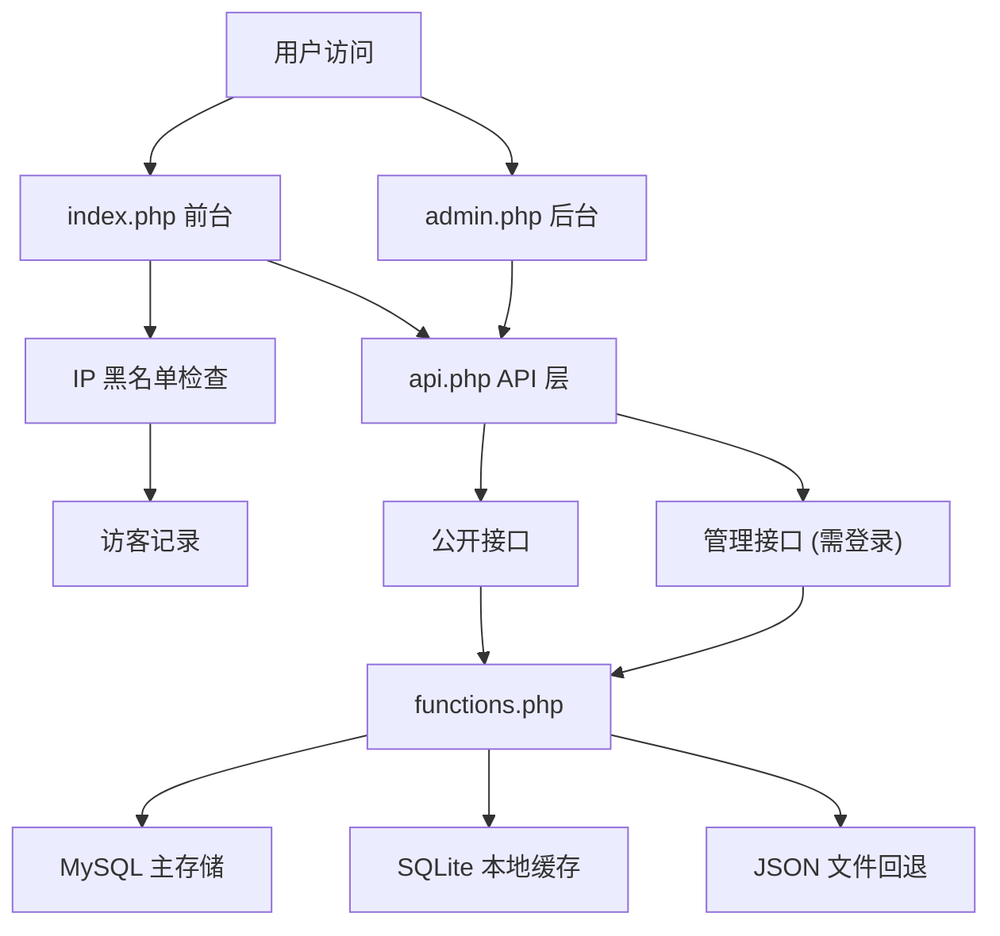
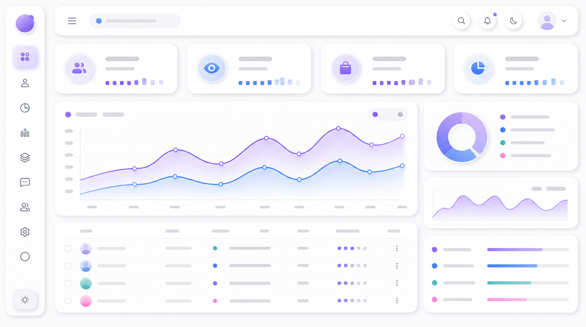

<p align="center">
  
  
  
  
</p>

<h1 align="center">Resource Navigator</h1>
<h3 align="center">一个漂亮的资源导航分享网站系统</h3>

<p align="center">
  
</p>

---

## 项目简介

**Resource Navigator** 是一个基于纯 PHP 架构的开源资源导航/分享网站系统。采用拟态设计风格（Neumorphism / Soft UI），支持暗黑模式，内置完整的后台管理系统。

适合用作资源分享站、工具导航站、游戏资源站等场景。无需任何框架，零 Composer 依赖，下载即用。

### 设计亮点

- **拟态软界面** — Neumorphism 设计风格，圆角卡片 + 柔和阴影，支持明暗双主题
- **灵动岛音乐播放器** — 内置 Dynamic Island 风格的音乐控制组件，支持播放列表与歌词
- **无框架依赖** — 纯 PHP 原生实现，零外部依赖
- **三层存储架构** — MySQL + SQLite + JSON 三级回退，灵活部署
- **安全可靠** — IP 黑名单、自动刷流量检测、频率限制、登录锁定

---

## 功能特性

<p align="center">
  
</p>

### 前台展示

| 功能 | 说明 |
|------|------|
| 资源卡片展示 | 卡片式网格布局，支持图标、颜色标识、描述信息 |
| 分区切换 | 多分区标签切换，各分区独立展示 |
| 搜索过滤 | 实时搜索过滤资源卡片 |
| 轮播图 | 可配置的图片轮播，支持桌面/移动端不同高度 |
| 密码保护 | 点击查看需输入密码验证，保护敏感资源 |
| 留言板 | 可折叠留言区域，支持回复、点赞 |
| 催更墙 | 资源催更功能，支持快捷模板和自定义内容 |
| 暗黑模式 | 浅色/深色主题一键切换，也可跟随系统 |
| 弹窗公告 | 首页可配置公告弹窗 |
| 访客统计 | 底部显示总浏览量、总访客、今日访客、当前在线 |
| 字体定制 | 支持 12+ Google Fonts 中文字体选择 |

### 后台管理

| 功能 | 说明 |
|------|------|
| 数据概览 | 统计卡片 + 近 7 日访问趋势图 (Chart.js) + 浏览器/设备分析 |
| 资源管理 | 增删改查、图标上传、颜色选择、排序拖动 |
| 访客记录 | IP 聚合/详细模式、分页、地理位置显示 |
| 留言管理 | 查看/回复/删除，管理员回复自动邮件通知 |
| 催更管理 | 查看/回复/删除催更记录 |
| 操作日志 | 操作日志 + 登录日志，分页查看 |
| IP 黑名单 | 单个/批量拉黑，解除拉黑申请审批 |
| 系统设置 | 弹窗公告、外观定制、安全设置、通知推送 |
| 轮播图管理 | 图片上传、排序、删除 |

### 通知推送

支持 **5 种通知通道**：

- **Server 酱** — 微信推送通知
- **WxPusher** — 微信推送
- **Bark** — iOS 推送
- **PushPlus** — 微信/邮件/钉钉
- **QQ 邮箱 SMTP** — 邮件通知

### 安全机制

- IP 黑名单管理 + 自动刷流量检测
- 管理后台登录失败 5 次锁定 5 分钟
- 留言/催更/点赞频率限制
- 后台密码保护

---

## 快速开始

### 环境要求

- PHP >= 7.4
- MySQL >= 5.7（可选，也支持纯 SQLite 模式）
- PDO 扩展（通常已默认安装）
- PHP 扩展：`pdo_mysql`、`pdo_sqlite`

### 安装步骤

```bash
# 克隆项目
git clone https://github.com/yourusername/resource-navigator.git
cd resource-navigator

# 确保 data/ 目录可写
chmod -R 755 data/
```

然后访问 `setup.php` 完成数据库配置，或手动编辑 `db_config.php`：

```php
<?php
return [
    'host'    => '127.0.0.1',
    'dbname'  => 'site_data',
    'user'    => 'root',
    'pass'    => 'your_password',
    'charset' => 'utf8mb4'
];
```

### 默认后台

- 后台地址：`admin.php`
- 默认密码：`admin`（**登录后请立即修改！**）

---

## 项目结构

```
resource-navigator/
├── index.php           # 前台入口 — 资源展示、留言、催更
├── admin.php           # 后台管理面板
├── api.php             # API 接口层 — 40+ 个接口端点
├── functions.php       # 核心函数库
├── setup.php           # 首次安装向导
├── db_install.php      # CLI 数据库安装脚本
├── db_store.php        # SQLite 存储封装类
├── db_config.php       # MySQL 连接配置（需自行创建）
└── data/               # 数据存储目录
    ├── resources.json   # 资源列表
    ├── icons/           # 资源图标上传
    ├── banners/         # 轮播图上传
    └── cache/           # IP 定位缓存
```

---

## 技术栈

| 类别 | 技术 |
|------|------|
| 后端语言 | PHP (原生，无框架) |
| 数据库 | MySQL 5.7+ / SQLite |
| 缓存 | JSON 文件 + SQLite |
| 前端 | 原生 HTML/CSS/JS，Neumorphism 风格 |
| 图表 | Chart.js |
| IP 定位 | ip-api.com |

---

## 数据流架构



---

## API 接口

系统提供 **40+ 个 API 端点**，按功能分类：

**公开接口：**
- `get_resources` — 获取资源列表
- `get_messages` / `add_message` / `like_message` — 留言 CRUD
- `get_urges` / `add_urge` — 催更功能
- `get_stats` / `track_click` — 统计与点击追踪
- `get_qq_groups` — 密码验证后获取群链接

**管理接口：**
- `admin_save_resource` / `admin_delete_resource` / `admin_sort_resources` — 资源管理
- `admin_get_visitors` / `admin_get_messages` / `admin_get_urges` — 数据查询
- `admin_save_settings` / `admin_upload_icon` — 系统配置
- `admin_blacklist_*` — 黑名单管理

---

## 自定义配置

所有前台文字、通知推送、安全规则均可在后台「系统设置」中配置：

- 店铺名称、副标题、图标
- 网站标题、字体
- 弹窗公告内容
- 各按钮文字（跳转按钮、QQ 群按钮、催更按钮等）
- 留言板/催更墙标题
- 频率限制参数
- 自动拉黑规则
- 数据统计偏移量

---

## 截图预览

<p align="center">
  
  <br>
  <em>前台首页 — 资源卡片 + 轮播图 + 搜索</em>
</p>

<p align="center">
  
  <br>
  <em>后台仪表盘 — 统计图表 + 数据分析</em>
</p>

---

## License

MIT License — 详见 [LICENSE](LICENSE) 文件。

---

## 贡献

欢迎提交 Issue 和 Pull Request。

---

<p align="center">
  Made with PHP, HTML, CSS & JavaScript
</p>
